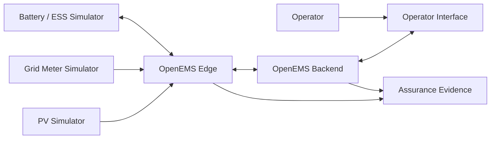

# Reference Architecture

## System context

The reference environment represents a fictional commercial site with solar generation, battery storage and a grid connection.

OpenEMS provides the local and central energy-management layers.

## Architectural roles

### OpenEMS Edge
Site-local measurement and control layer.

### OpenEMS Backend
Central visibility and management layer.

### Simulated energy assets
PV generation, battery energy storage and grid measurement provide repeatable test inputs without representing production infrastructure.

## Trust boundaries

### TB-01 — Field assets to Edge
Measurement and control information crosses the asset-facing boundary.

### TB-02 — Edge to Backend
Central telemetry and management traffic crosses this boundary. This is the primary boundary exercised by the first failure scenario.

### TB-03 — Backend to operator
Identity, authorisation and central visibility become relevant here.

### TB-04 — Operational system to assurance evidence
Logs, channel values, timestamps and configuration become evidence supporting or contradicting the assurance claim.

### TB-05 — Physical site
A production Edge would depend on physical access, power, environmental conditions and local communications. These dependencies are analysed but not physically tested in the simulation.

## Primary failure path

The first scenario removes:

`OpenEMS Edge <-> OpenEMS Backend`

while retaining:

`PV / BESS / Meter <-> OpenEMS Edge`

The experiment then examines local control behaviour and the evidence available after recovery.
